# HTML, CSS & JS Projects

预计是会跟着教程做完 53 个小项目+10 个大型的 Responsive 项目，预览地址在<http://www.goldenaarcher.com/html-css-js-proj/>，git 地址：<https://github.com/GoldenaArcher/html-css-js-proj>

实用性有加备注，可以按需索取，如果有些效果不一样……十有八九可能是因为 google font 的问题。主要是以 CSS 实现为主，不过有些需要互动的部分会借助 JS 实现

gif 截图的话，尽量放全……

很神奇的事情就是，github 上引用 CSDN 上的图片外链，有几张图片居然显示过大（挠头），然后 READEME 上就打不开……

## Small Projects

1.  [signup form](./proj1/index.html)

    Animation & Layout & transition，日常开发可能会用到

    

2.  [nike product card](./proj2/index.html)

    Animation & Layout & transition，专项化 2C 项目非常可能会用到

    

3.  [dark mode](./proj3/index.html)

    Layout & JS (toggle class)，日常开发可能会用到

    卡的布局确实挺有趣的，除了背景图片（地图）和芯片之外，其他全都使用 HTML+CSS 完成的，完成度还蛮高的……

    所以说以后都不用自己 p 信用卡了是吧，想要东方、高达啥的，换个背景图就好了……？

    

4.  [3D swing](./proj4/index.html)

    3D & layout

    炫技之作，看看就好，平常用不太到，特别想展示个人能力的可以作 portfolio 的时候试着写个类似的 3D 玩玩?

    丢帧是软件问题，一边存一边用 live server 然后就一直重载页面……

    

5.  [3D Menu](./proj5/index.html)

    3D & layout & transition

    个人项目可能用得到

    

6.  [Landing Page](./proj6/index.html)

    3D & layout & transition

    个人项目可能用得到

    丢帧是软件问题，一边存一边用 live server 然后就一直重载页面……

    

7.  [3D Button](./proj7/index.html)

    `::before` & `::after`

    个人项目可能用得到

    

8.  [Animated Landing Page](./proj8/index.html)

    日常开发可能会用到，纯 CSS 实现

    主要用的是 CSS 中的 `keyframes` 实现

    

9.  [Landing Page with Modal](./proj9/index.html)

    日常开发可能会用到

    如果是用 React/Vue/Angular 这种的话，应该已经有不少的 npm package 可以做相似的功能了，不过如果业务场景比较简单，想纯手写的话，也可以自己实现。

    React 用 portal 传送 modal 会比较方便……如果在组件内渲染一来会有 z-index 的问题，而来语义化不明确

    

    portal 案例学习：[[React 进阶系列] React Portal 案例学习](https://blog.csdn.net/weixin_42938619/article/details/123952981)

10. [3D Room](./proj10/index.html)

    除非开发网页游戏，否则感觉用不太到……

    

    成品出来的效果蛮惊艳的，没有图片，效果都是通过 3D+transition+transform 做的，HTML 就这么几行：

    ```html
    <div class="room">
      <button class="btn">Read Letter</button>
      <div class="table">
        <h3 class="letter">
          Lorem, ipsum dolor sit amet consectetur adipisicing elit. Eligendi
          consequuntur minima non magnam modi odit est suscipit similique minus
          saepe?
        </h3>
        <div class="table-leg table-leg-1"></div>
        <div class="table-leg table-leg-2"></div>
        <div class="table-leg table-leg-3"></div>
        <div class="floor"></div>
      </div>
    </div>
    ```

    3D 做桌子的未完成效果如下：

    

    有一个可能平常会用得到，就是这个网格效果

    

    实现用的 CSS 如下：

    ```css
    background-image: repeating-conic-gradient(
      from 90deg,
      #000 0deg 90deg,
      #333 90deg 180deg
    );
    ```

11. [Grid Gallery](./proj11/index.html)

    日常开发可能会用到

    grid 算是解决了 2D 布局的问题，如果不考虑支持（基本上就是抛弃 IE），现在的主流浏览器支持都挺好的

    其主要的特性就是自适应，如在没有设置图片大小时，浏览器的自适应是这样的：

    

    设置了图片占据当前格子 100%时：

    

    排版后的效果：

    

    想要用 flex 实现当前的效果挺麻烦的……grid 的话，只要对每张图片占据的行列数，使用 `grid-column` 和 `grid-row: 3/5;` 进行赋值就可以了

    之前翻书时的 grid 相关笔记在：[精通 CSS 第 7 章学习笔记（下）](https://goldenaarcher.blog.csdn.net/article/details/116337852)

12. [Toggle Button](./proj12/index.html)

    日常开发可能会用到，取决于 UI 库的使用和需求，如果有 UI 库的使用，大概率是会覆盖这个。但是如果自己要实现 UI 库的话，可能会写类似的样式

    

13. [Product Card](./proj13/index.html)

    日常开发可能会用到，这个和之前耐克的有点像，不过特效不太一样。不过日常开发中，这种 hover+scale 的效果用的还是挺多的，不仅是产品，很多 card 都有这种特效

    但是基本效果之前都有写过，这里唯一的区别算是加了一个响应式吧……

    

    

    

    

14. [Bicycle](./proj14/index.html)

    日常开发用不到，不过用来学习挺好的，所有的样式和动画全都是通过 CSS 实现的……这个几何的实现能力太强了啊，而且一行 JS 没写，真秀了我一脸……

    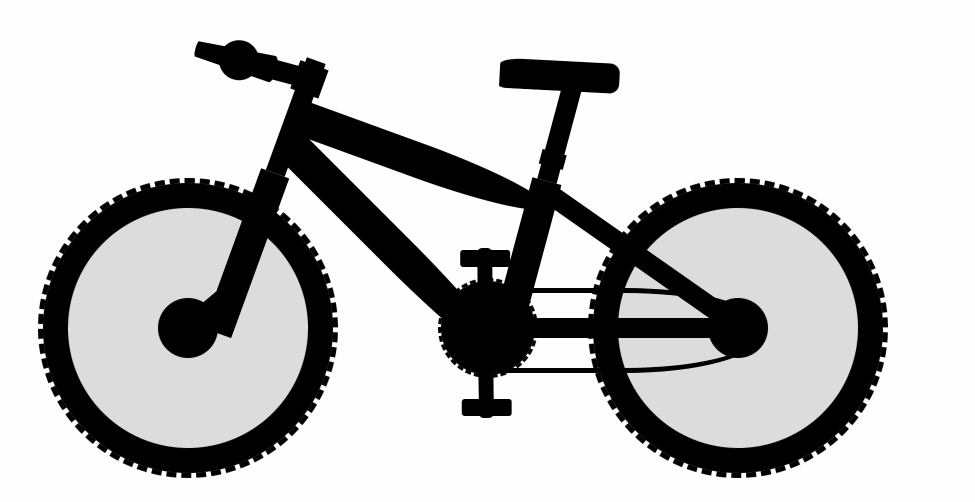

    用法比较多的还是使用 `::before` 和 `::after`，主要是定位方便，还不用多创建额外的 div，全部的 HTML 如下：

    ```html
    <div class="bicycle">
      <div class="wheel front-wheel"></div>
      <div class="front-fork">
        <div class="tube"></div>
      </div>
      <div class="handlebars"></div>
      <div class="crossbar"></div>
      <div class="frame-1"></div>
      <div class="frame-2"></div>
      <div class="seat-tube">
        <div class="seat"></div>
      </div>
      <div class="crank"></div>
      <div class="chain"></div>
      <div class="pedals"></div>
      <div class="back-fork"></div>
      <div class="wheel back-wheel"></div>
    </div>
    ```

15. [Hamburger Menu](./proj15/index.html)

    日常开发可能用到

    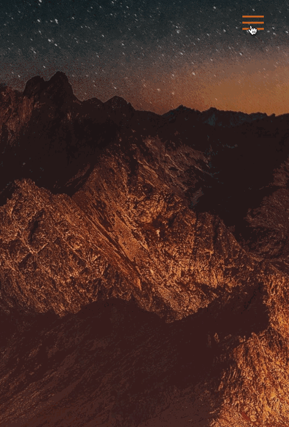

    另一个学 SCSS 时候的 navbar 笔记在这里：

    [SASS 学习笔记](https://blog.csdn.net/weixin_42938619/article/details/132310288)

    效果如下：

    

16. [Checkbox](./proj16/index.html)

    和 toggle button 一样，如果有 UI 开发的需求会用得到

    

17. [3D Card](./proj17/index.html)

    日常用得到，基本逻辑其实上面都实现过挺多次了

    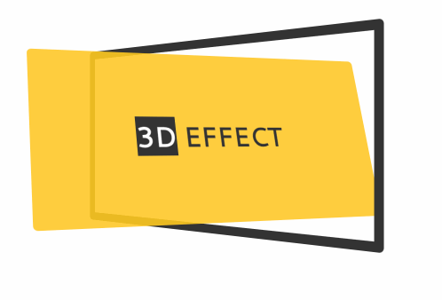

18. [Helicopter](./proj18/index.html)

    和自行车一样，炫技之作，不过背景的移动倒是具有一些参考意义，有些情况下可能会用得到

    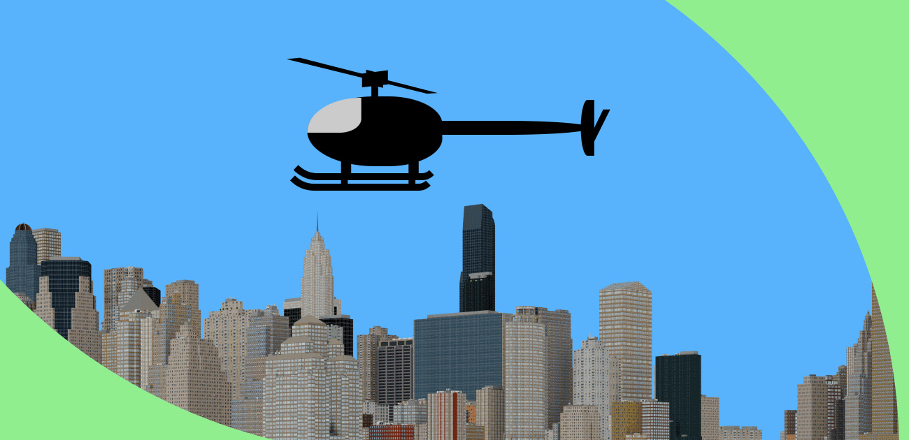

19. [Business Card](./proj19/index.html)

    日常……可能用得到……？感觉如果有什么 logo 需要 hover，并且正反内容都不一样的话，确实有可能需要。

    这个技巧比较妙的就是，它是纯 CSS 实现，没用 JS。

    

    card 的特效和之前写的差不多，不过这个最主要的区别还是在于前后卡片内容不同，并且全都由 CSS 控制，这里也学到了一个新的 CSS：

    ```css
    backface-visibility: hidden;
    ```

    这样在翻转到反面时（backface），卡片的内容就是隐藏的了。

    没有这个特性的效果如下：

    

    

    这个特性在实现的时候会同时管理前后两面的 `visibility`，不怎么做 3D 还真的不太了解这些 CSS……

    之前在学黑马的时候也有做过类似的特效：

    

    区别在于这个这个用了 `z-index` 去进行控制管理，二者实现上稍稍不太一样，不过同样都挺妙的。

    这个硬币的笔记在：[学完一起做个走马灯吧 - CSS 3D 转换学习笔记&学习案例](https://blog.csdn.net/weixin_42938619/article/details/117097939)

    里面对于 2D 和 3D 的转换有更多的解释性注释。

    另外一点就是背景的实现，这里用的是 `linear-gradient`，然后子内容用的是 `margin` 去控制和边框的距离:

    ```css
    background: linear-gradient(
      100deg,
      rgb(255, 255, 255) 40%,
      rgb(38, 38, 38) 0
    );
    ```

    另一种技巧用的是 `border`：

    

    我个人可能会偏向用 `border` 去实现……？这样感觉 `margin` 的过度是不是会更自然……？但是这样的话，姓名那边要做到左边穿模也要另外加一下 `border-left` 去拼一个三角补全缺口吧……

    上面 border 的笔记：[CSS 的十个高级使用技巧](https://goldenaarcher.blog.csdn.net/article/details/116216232)

20. [Radio Button](./proj20/index.html)

    同 toggle 和 checkbox

    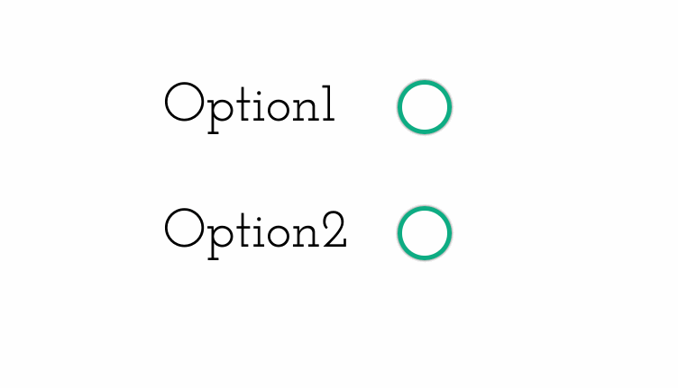

21. [Slide Show](./proj21/index.html)

    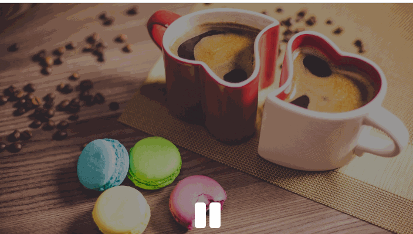

    日常……可能用得到……？

    主要还是看业务需求，如果使用框架，大多数情况下总是能够找到对应的 react/vue/ang 的 slideshow/carousel，二者都是用来寻找这个类似功能的关键词，看怎么命名了，前者叫幻灯片，后者叫轮播，这里指代的就是一个东西

    总体效果有这么几个，因为间隔时间比较多，所以可能看得不是很清楚：

    1. 自动播放
    2. 喜爱暗的按钮可以控制自动播放，点击一下停止转播放或反过来
    3. 点击左右手动翻页停止播放

    CSS 方面这里倒是没有什么特别特殊的技巧，主要还是用 JS 控制 slideshow 的播放和 class 的增删

    我还以为写过好几个 slide show，结果找了一下一个都没看到，这可真是……

    不~敢~相~信~

22. [Atom Animation](./proj22/index.html)

    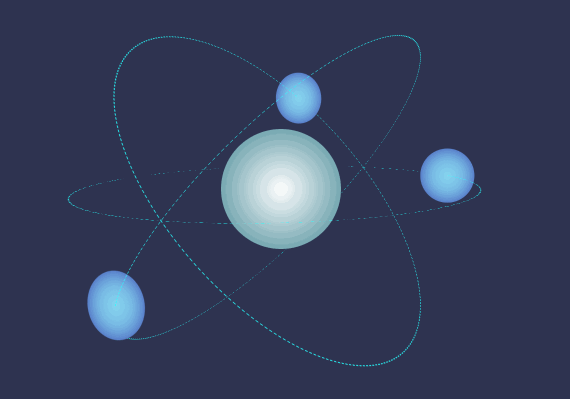

    也是纯 CSS 实现，主要就是 3D+animation 特效的这些事儿，使用场景感觉也有限，不过用来学学 3D 挺好的

    另外就是，如果要做正方/正圆，可以定义高度之后使用 `aspect-ration: 1;` 进行实现

23. [Button](./proj23/index.html)

    

    和其他的 UI 功能需求相似

24. [Hamburger Menu2](./proj24/index.html)

    日常可能用得到，不过如果使用 UI 库的话有一定概率 navbar 是覆盖内容

    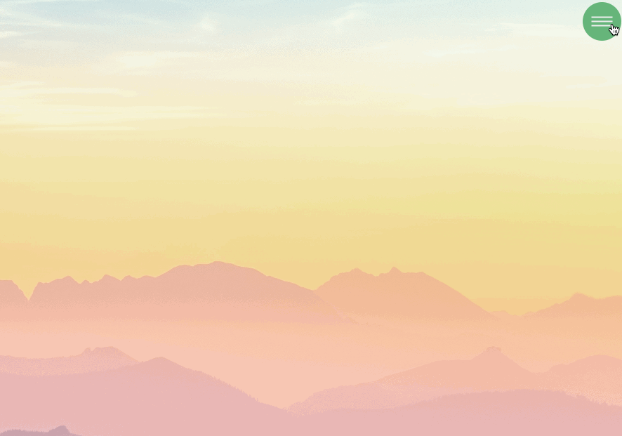

    其实这个效果之前有提到过，这里唯一的区别大概就是多了一个背景放大的过度，以及 menu 不是出现在 sidebar，而是出现在屏幕正中间

    

    这是另一个效果的直观对比，可以看出来 hamburger icon 的效果是一样的，这里的是一个简化版

25. [Sidebar](./proj25/index.html)

    日常可能用得到，不过如果使用 UI 库的话有一定概率 sidebar 是覆盖内容

    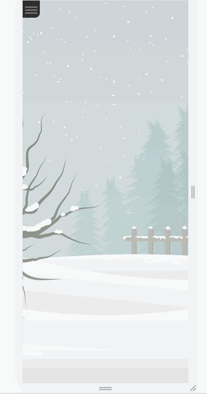

    特效大概是这样的

    这里做了几个 breakpoints，主要就是 menu 和背景的大小区别，小屏幕两个都是全屏，大屏幕大概是 55 分，37 分，28 分这样，就不重复放了

    顺便讲几个新学到的 tricks：

    1. 定位

       

       这也算是一个新的 trick 吧，以前都是用 `position: absolute` 去解决的，这里使用的是 `transform: translateX()`，也是以前没有考虑过的点

    2. flex-grow

       

       不用 `flex-grow: 1` 的效果：

       

       `flex-grow: 1` 会让当前内容，也就是这个 text 的内容填补这个 flex 剩下的所有空间，间接实现了让箭头填充到最右边的功能。

       以前看的免费教程大多数都是比较老的教程，里面 flex 相对而言都是比较新的内容，所以一般都是用 `position: absolute` 把旁边的 icon 拉出文档流。现在看来使用 `flex` 的方法代码量更少，实现起来也挺妙的。

    3. flex & margin

       

       使用 `margin-left: auto` 就会自动的实现左对齐，即等同于 `margin-left: 10% `

       

       上面是这是不使用 `margin-left: auto` 的情况。不过就算使用 `margin-right: 0`，其实也不会将多余的部分 assign 给 `margin-left`

       同样实现的内容还有父元素使用 `padding-left` 之类的，总体来说实现方法较多

    这个负载度在这个半成品系列中算是比较高的了，顺便感叹下，在 yt 上刷新的 css 教程果然……还蛮新的……

26. [Flower](./proj26/index.html)

    用不太到，但是思路挺有趣的，如果想要更加自然一点的效果，可以不同花瓣使用 z-index 调整一下，或者看看能不能用 pseudo-element 增加点锯齿/大小。当然，本身效果就挺自然的，自然界的花朵同一朵花上的花瓣其实真说起来差异不是特别大

    这还是第一个静态的，效果如下：

    

    其实这里主要还是更深入地了解了一下 `::before` 和 `::after` 的特性，如果直接讲 CSS 作用在 div 上，那么在做 rotate 的时候会将原本的 CSS 也进行修改：

    

    

    但是如果用 `::before` 和 `::after` 的话，那么 `::before` 和 `::after` 上的 CSS 只会随着主 div 上的 css 进行修改，本身变形

    

    堆叠效果玩成后：

    

27. [Navbar](./proj27/index.html)

    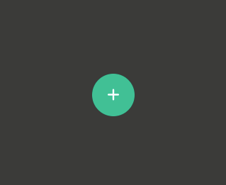

    日常可能用得到，思路比较巧妙的 navbar，适用于个人项目或者特质化项目，一般情况下 UI 库应该是会包括这个功能了

28. [Navigation 2](./proj28/index.html)

    

    同上

29. [dropdown](./proj29/index.html)

    实用性同其他的 UI 组件一样

    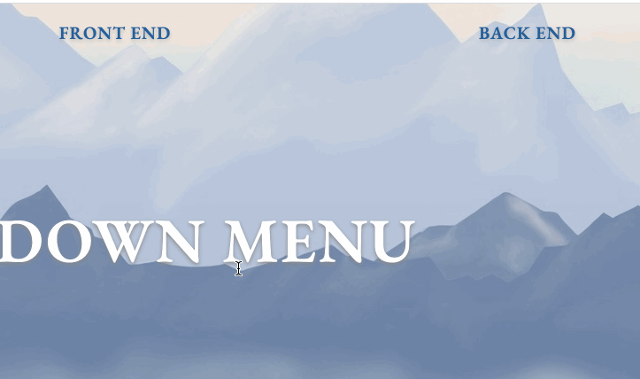

    有个比较有趣的特点就是，这个 dropdown 的视线是二阶段的，它的组成也是通过两部分实现，第一个是白色的背景，第二个才是下拉框的主题：

    

    动画的实现有几个要点：

    - CSS 中，dropdown 主体的高度从 `0`，hover 时变为 `auto` 让 CSS 自动计算高度
    - 通过 JS 获取当前下拉框的长度，并将下拉框的值赋给背景
    - 为了实现从有到左的淡入，dropdown 的主题有一个 `translateX()` 的位移
    - 为了完成延迟渲染的效果，dropdown 本体的 animation 需要有一个 delay 的操作

    这样综合操作就能够完成先显示背景，随后主题内容再滑入的一个特效

    个人来说这样的实现有好有坏，最大的问题就在于会有一个额外的 div 悬浮在空中：

    

    如果验货一方完全不懂技术，这个还是可以操作的，但是如果上一些 automated test 的话，可能会有点问题

30. [navigation](./proj30/index.html)

    

    和其他的 nav 差不多，适合个人/特质化项目

    顺便提一下这里用到的挺有趣的一个特性，就是 `pointer-events: none`，这个 CSS 主要是可以管理鼠标时间，比如说，其实这些 div 都是存在的，只不过 opacity 设置成了 1:

    

    但是上面的动图很明显的可以看到，鼠标经过原本图标所在的地方时，背景变色的动画并没有被触发，这实际上是因为子类所有的 pointer-events，在没有 FOLLOW US 这段话没有被 hover 的时候，是设置成 none，也就是任何鼠标事件都不被触发。当 hover 事件触发后，pointer-events 设置成了自动，那么该元素的鼠标事件才会正常被触发。

    这也是一个相对而言比较新，但是以前没接触过的 CSS3 的知识点。

31. [animated earth](./proj32/index.html)

    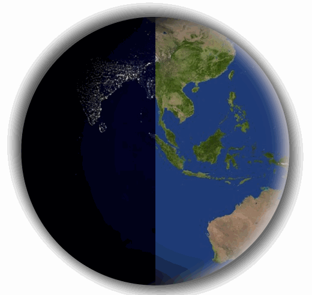

    不太常用，这里亮暗地图用的是图片，所以相似的案例反而找图会比较困难。其他方面，CSS 本身不太复杂，主要是几个比较少见的特性运用：

    - clip-path

      <https://bennettfeely.com/clippy/>

      可以到上面这个网站研究一下想要的形状，这是拖拽式的

    - box-shadow

      这里主要同时应用了外部和内部的，并且内部的 inset 是用了亮色，形成了明暗对比

32. [grid menu](./proj32/index.html)

    完成布局后大概这样：

    

    特效：

    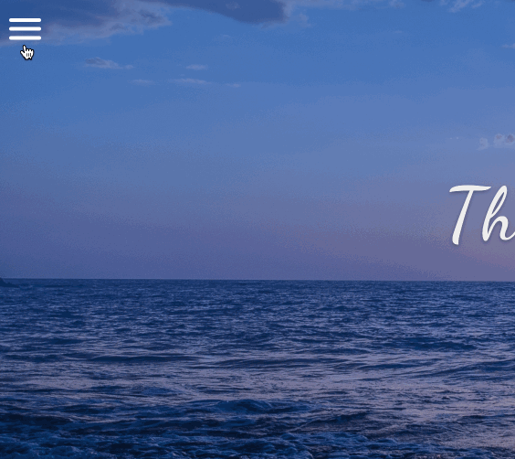

    CSS grid 之前多多少少提过一些，现在这里再复述一下。简单来说就是对于页面的 2D 规划，grid 是有无与伦比的优势的。简单的三行代码就可以实现如下布局：

    

    ```css
    display: grid;
    grid-template-columns: 2rem 1fr 2rem;
    grid-template-rows: 10rem 1fr 2rem;
    ```

    对于将内容放置于网格上的操作也很简单，如我想将内容放置于中间最大的那块，只需要选中对应的 div，然后添加代码：

    ```css
    grid-column: 2/3;
    grid-row: 2/3;
    ```

    就可以轻松实现效果：

    

    特效部分，这里做的延迟主要就是应用两重 `transition`，并且使用 delay 做延迟。

    这里也做了 responsive，基本上来说就是要把所有的布局都重写一遍，如：

    

    最后，写到一半突然注意到这个：

    
