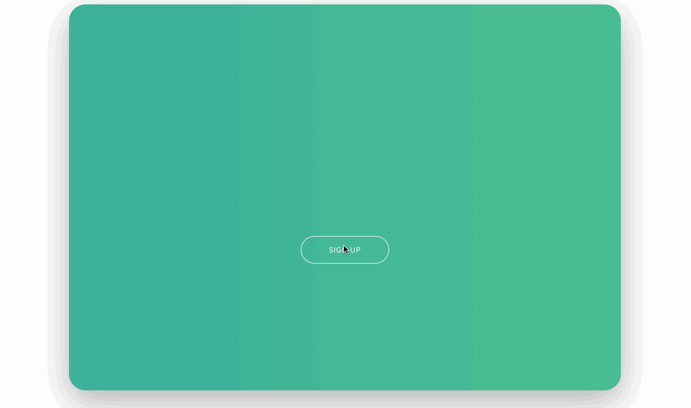
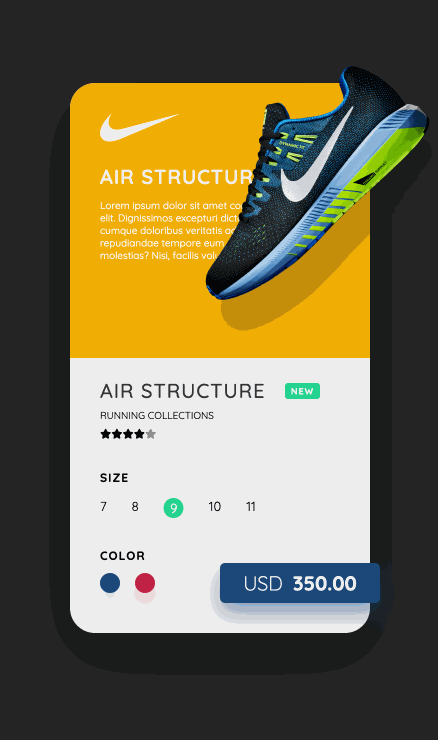
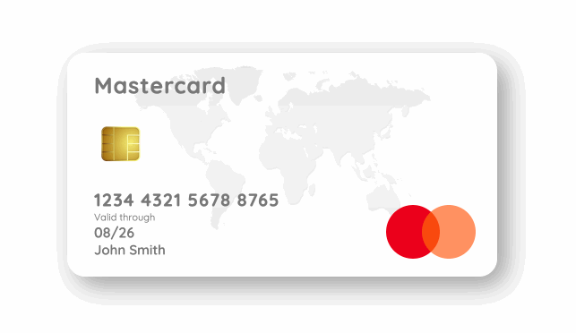
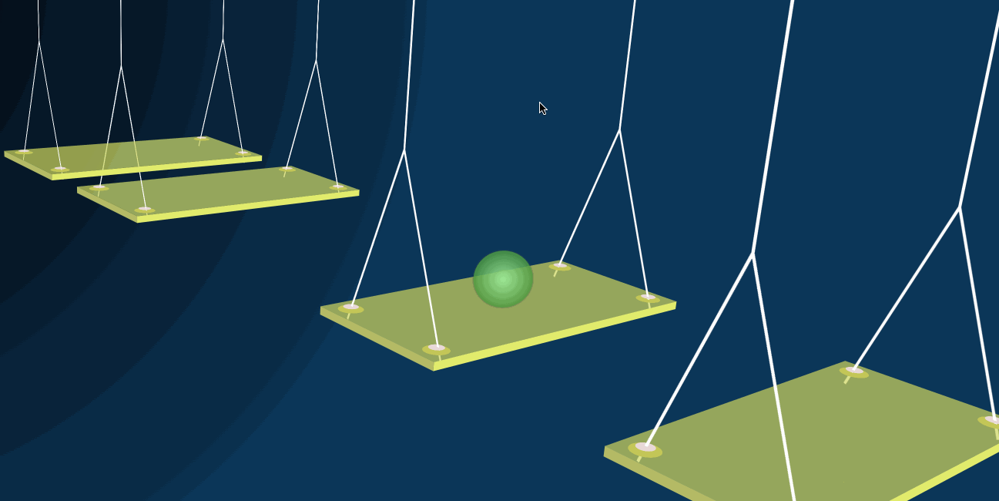
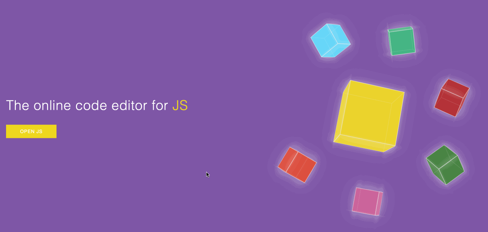
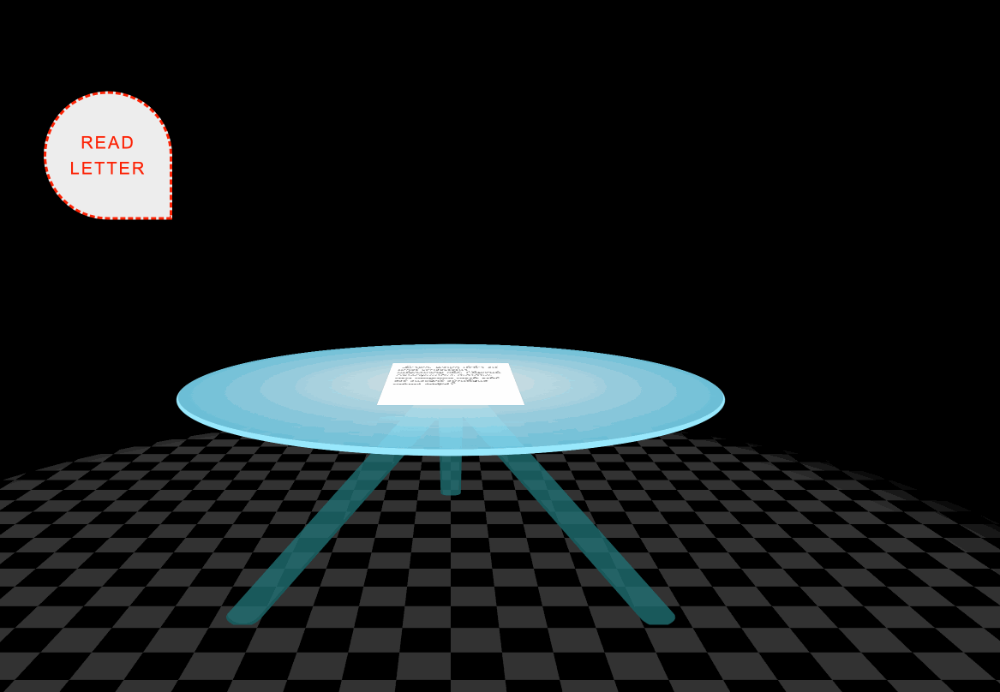
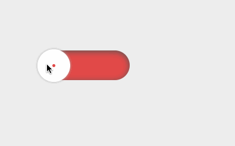
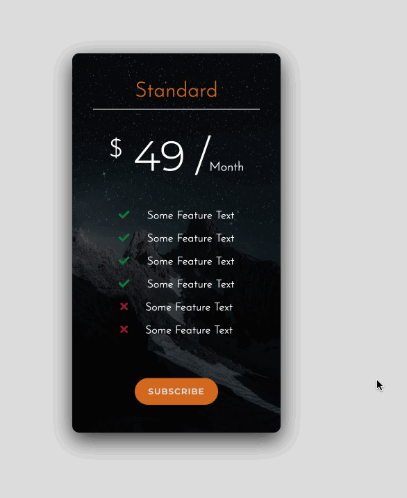

# HTML, CSS & JS Projects

预计是会跟着教程做完 53 个小项目+10 个大型的 Responsive 项目，预览地址在<http://www.goldenaarcher.com/html-css-js-proj/>，git 地址：<https://github.com/GoldenaArcher/html-css-js-proj>

实用性有加备注，可以按需索取，如果有些效果不一样……十有八九可能是因为 google font 的问题

gif 截图的话，github 上是全的，csdn 上放多少看我有多勤劳了（x

## Small Projects

1. [signup form](./proj1/index.html)

   Animation & Layout & transition，日常开发可能会用到

   

2. [nike product card](./proj2/index.html)

   Animation & Layout & transition，专项化 2C 项目非常可能会用到

   

3. [dark mode](./proj3/index.html)

   Layout & JS (toggle class)，日常开发可能会用到

   卡的布局确实挺有趣的，除了背景图片（地图）和芯片之外，其他全都使用 HTML+CSS 完成的，完成度还蛮高的……

   所以说以后都不用自己 p 信用卡了是吧，想要东方、高达啥的，换个背景图就好了……？

   

4. [3D swing](./proj4/index.html)

   3D & layout

   炫技之作，看看就好，平常用不太到，特别想展示个人能力的可以作 portfolio 的时候试着写个类似的 3D 玩玩?

   丢帧是软件问题，一边存一边用 live server 然后就一直重载页面……

   

5. [3D Menu](./proj5/index.html)

   3D & layout & transition

   个人项目可能用得到

   

6. [Landing Page](./proj6/index.html)

   3D & layout & transition

   个人项目可能用得到

   丢帧是软件问题，一边存一边用 live server 然后就一直重载页面……

   

7. [3D Button](./proj7/index.html)

   `::before` & `::after`

   个人项目可能用得到

   

8. [Animated Landing Page](./proj8/index.html)

   日常开发可能会用到，纯 CSS 实现

   主要用的是 CSS 中的 `keyframes` 实现

   

9. [Landing Page with Modal](./proj9/index.html)

   日常开发可能会用到

   如果是用 React/Vue/Angular 这种的话，应该已经有不少的 npm package 可以做相似的功能了，不过如果业务场景比较简单，想纯手写的话，也可以自己实现。

   React 用 portal 传送 modal 会比较方便……如果在组件内渲染一来会有 z-index 的问题，而来语义化不明确

   

   portal 案例学习：[[React 进阶系列] React Portal 案例学习](https://blog.csdn.net/weixin_42938619/article/details/123952981)

10. [3D Room](./proj10/index.html)

    除非开发网页游戏，否则感觉用不太到……

    

    成品出来的效果蛮惊艳的，没有图片，效果都是通过 3D+transition+transform 做的，HTML 就这么几行：

    ```html
    <div class="room">
      <button class="btn">Read Letter</button>
      <div class="table">
        <h3 class="letter">
          Lorem, ipsum dolor sit amet consectetur adipisicing elit. Eligendi
          consequuntur minima non magnam modi odit est suscipit similique minus
          saepe?
        </h3>
        <div class="table-leg table-leg-1"></div>
        <div class="table-leg table-leg-2"></div>
        <div class="table-leg table-leg-3"></div>
        <div class="floor"></div>
      </div>
    </div>
    ```

    3D 做桌子的未完成效果如下：

    

    有一个可能平常会用得到，就是这个网格效果

    

    实现用的 CSS 如下：

    ```css
    background-image: repeating-conic-gradient(
      from 90deg,
      #000 0deg 90deg,
      #333 90deg 180deg
    );
    ```

11. [Grid Gallery](./proj11/index.html)

    日常开发可能会用到

    grid 算是解决了 2D 布局的问题，如果不考虑支持（基本上就是抛弃 IE），现在的主流浏览器支持都挺好的

    其主要的特性就是自适应，如在没有设置图片大小时，浏览器的自适应是这样的：

    

    设置了图片占据当前格子 100%时：

    

    排版后的效果：

    

    想要用 flex 实现当前的效果挺麻烦的……grid 的话，只要对每张图片占据的行列数，使用 `grid-column` 和 `grid-row: 3/5;` 进行赋值就可以了

    之前翻书时的 grid 相关笔记在：[精通 CSS 第 7 章学习笔记（下）](https://goldenaarcher.blog.csdn.net/article/details/116337852)

12. [Toggle Button](./proj12/index.html)

    日常开发可能会用到，取决于 UI 库的使用和需求，如果有 UI 库的使用，大概率是会覆盖这个。但是如果自己要实现 UI 库的话，可能会写类似的样式

    

13. [Product Card](./proj13/index.html)

    日常开发可能会用到，这个和之前耐克的有点像，不过特效不太一样。不过日常开发中，这种 hover+scale 的效果用的还是挺多的，不仅是产品，很多 card 都有这种特效

    但是基本效果之前都有写过，这里唯一的区别算是加了一个响应式吧……

    

    

    

    
